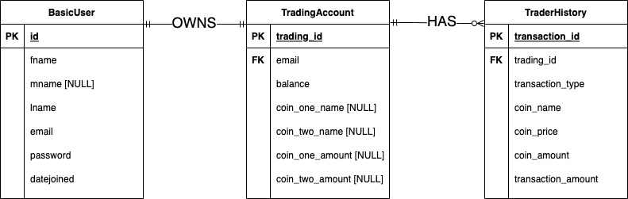

# **Cryptocurrency Trading Practice App** 
#### Creator: Ronak Trivedi
#### Github: https://github.com/ronak2

 
 

## <u>**Local Useage**</u>

#### **Launch in browser:**
- #### In a terminal, navigate to the crypto_simulator directory from the root directory of the project.
- #### Run the command:  `npm start` 
- #### In a web browser, visit:  `localhost:4000`

#### **Run test cases:**
- #### In a terminal, navigate to the crypto_simulator directory from the root directory of the project.
- #### Run the command:  `npm test` 
- #### Observe testing results in the console.

 
 

## <u>**Entity-Relation Diagram of Database**</u>

 
 

## <u>**Critical Development Tools**</u>
- #### Node.js
- #### Passport.js
- #### SQLite3
- #### Jest Testing Framework
- #### CoinGecko API

